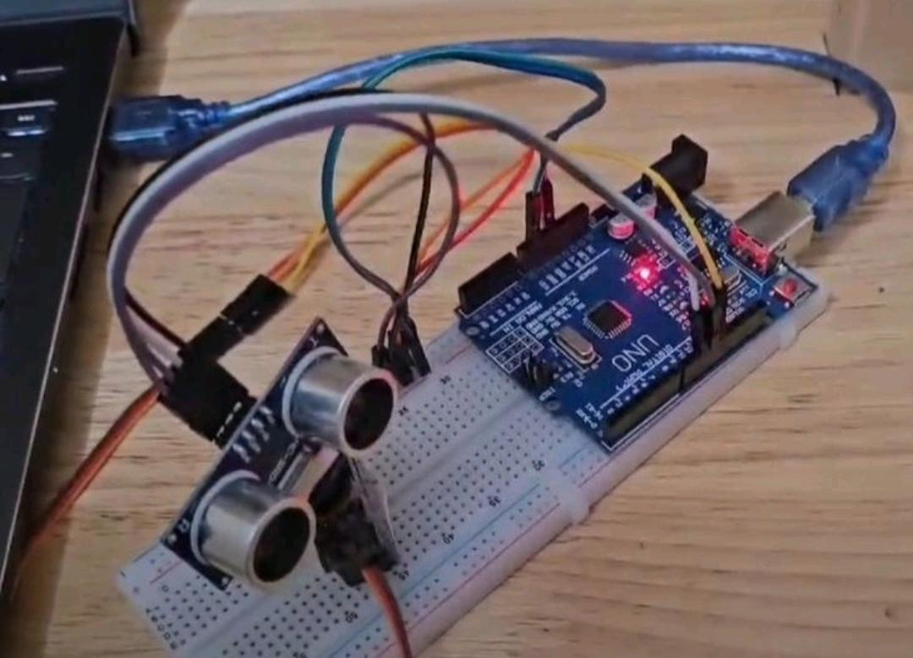
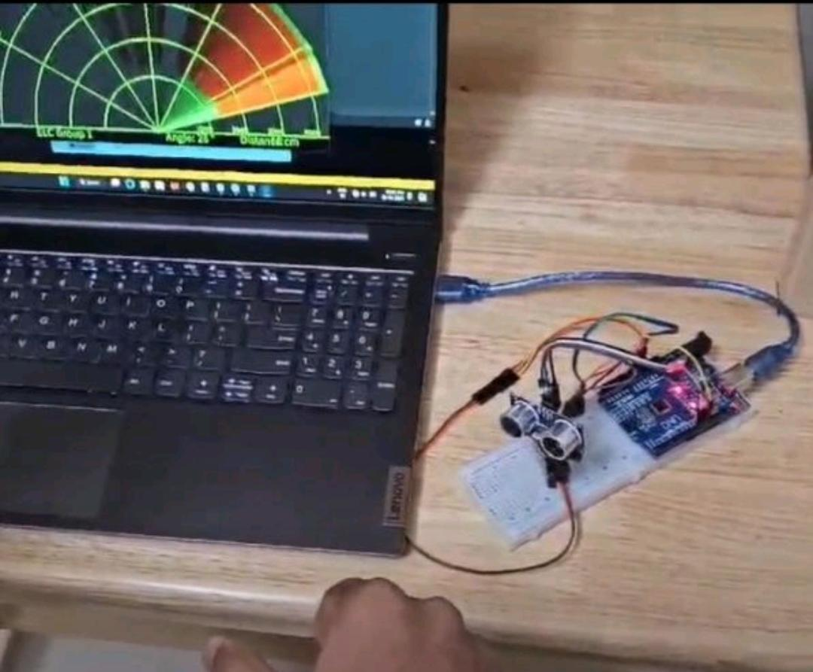

# Arduino Ultrasonic Radar System
Arduino-based ultrasonic radar system using HC-SR04 and servo motor to detect objects and display their position in real-time.

## Project Setup

##Output Visualization

## Components Used

* Arduino Uno
* HC-SR04 Ultrasonic Sensor
* Servo Motor
* Breadboard
* Jumper Wires

## Software Used

* Arduino IDE
* Processing IDE

## Data Flow

Ultrasonic Sensor → Arduino → Serial → Processing → Radar Display

## Features

* Real-time object detection
* Angle-based scanning
* Radar-style visualization

## How to Run

1. Upload Arduino code
2. Connect circuit
3. Run Processing code
4. Observe radar display

